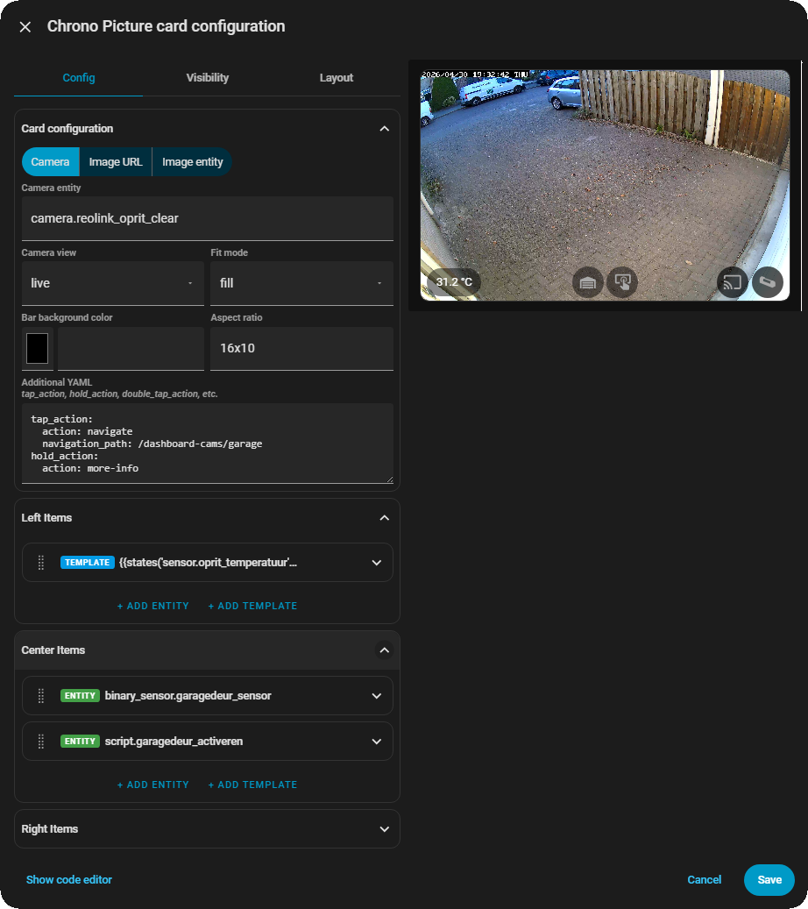

  
 <div align="center">

  [](https://github.com/hacs/integration)
  [](https://www.gnu.org/licenses/agpl-3.0)
  [](#)

  

  

  <p align="center">
    <strong>A camera and image card for Home Assistant dashboards.<br>
            Display live camera feeds or static images with a fully configurable<br>
            overlay bar supporting live Jinja2 templates and entity controls.</strong>
  </p>

  <p align="center">
    <a href="#introduction">Introduction</a> •
    <a href="#key-features">Key Features</a> •
    <a href="#installation">Installation</a> •
    <a href="#configuration">Configuration</a> •
    <a href="#license">License</a>
  </p>

</div>

---

**Chrono Picture Card** is a drop-in replacement and upgrade for Home Assistant's built-in Picture Glance card. It displays a live camera feed or static image with an overlay bar at the bottom, divided into three independently configurable zones: left, center, and right. Each zone can contain any number of entity controls and live template items — fully styled per item, with individual backgrounds, typography, padding, and border radius.

The card ships with a complete visual editor. No YAML knowledge is required for the most common use cases, and a built-in YAML textarea per item allows full access to advanced properties like `tap_action`, `hold_action`, and `call-service` data without leaving the editor.

---

## 📋 Table of Contents

- [Introduction](#introduction)
- [Key Features](#key-features)
- [Installation](#installation)
  - [HACS (Recommended)](#hacs-recommended)
  - [Manual Installation](#manual-installation)
- [Uninstallation](#uninstallation)
- [Configuration](#configuration)
  - [Card Options](#card-options)
  - [Bar Zone Options](#bar-zone-options)
  - [Entity Item Options](#entity-item-options)
  - [Template Item Options](#template-item-options)
  - [Advanced: Additional YAML](#advanced-additional-yaml)
- [Examples](#examples)
- [License](#license)
- [Support](#support)

---

## 🚀 Key Features

### 📷 Camera Feeds and Static Images
The card supports live camera streams, static image URLs, and HA `image` or `person` entities as the card background. Camera view mode (auto or live), fit mode (cover, contain, fill), object position, and aspect ratio are all configurable directly from the visual editor.

### 🎛️ Three-Zone Overlay Bar
The overlay bar is divided into left, center, and right zones. Each zone is independently populated with entity items and template items in any combination, in any order. Zones are rendered with correct flex alignment: left-aligned, centered, and right-aligned respectively.

### 🏷️ Entity Items with Default Domain Actions
Entity items display the entity's icon and respond to taps with the correct default action for their domain — toggle for lights, switches, scripts, covers, and fans; more-info for sensors and binary sensors. The default action can be overridden per item via the additional YAML textarea.

### 📊 Live Jinja2 Template Items
Template items evaluate any Jinja2 expression against Home Assistant's state machine in real time via a WebSocket subscription. The rendered value updates automatically whenever the underlying entities change — no polling required. Use templates to display sensor values, computed text, or any dynamic content directly in the bar.

### 🎨 Full Per-Item Styling
Every item — entity or template — has its own font color, font size, font weight, line height, background color, border radius, and padding controls. This makes it straightforward to render icons with circular colored backgrounds, or display temperature readings with custom typography, all without any CSS hacking.

### ✏️ Full Visual Editor
Every property is configurable through the Lovelace UI editor. A source type selector (Camera / Image URL / Image entity) cleanly presents only the relevant fields. Items can be added, removed, and reordered via drag-and-drop within each zone. A YAML textarea per item and a card-level YAML textarea provide full access to advanced properties without requiring raw YAML editing.

### 🎭 HA Theme Aware
Icon colors follow HA's standard picture card CSS variables (`--ha-picture-icon-button-color` for inactive, `--ha-picture-icon-button-on-color` for active states), so the card integrates naturally with any theme.

---

## 📦 Installation

### HACS (Recommended)

1. Open **HACS** in your Home Assistant instance.
2. Navigate to **Frontend** and click the three-dot menu in the top right corner.
3. Select **Custom repositories**.
4. Enter `https://github.com/rob-vandenberg/chrono-picture-card` and select **Lovelace** as the category.
5. Click **Add**. The repository will appear in the list.
6. Search for `Chrono Picture Card` and click **Download**.
7. Reload your browser.

### Manual Installation

1. Download `chrono-picture-card.js` from the [latest release](https://github.com/rob-vandenberg/chrono-picture-card/releases/latest).
2. Copy it to your Home Assistant `config/www/` folder.
3. In Home Assistant, go to **Settings → Dashboards → Resources**.
4. Click **Add Resource**.
5. Enter `/local/chrono-picture-card.js` as the URL and select **JavaScript Module**.
6. Click **Create** and reload your browser.

---

## 🗑️ Uninstallation

### Via HACS
1. Open **HACS → Frontend**.
2. Find **Chrono Picture Card** and click the three-dot menu.
3. Select **Remove**.
4. Reload your browser.

### Manual
1. Delete `chrono-picture-card.js` from `config/www/`.
2. Remove the resource entry from **Settings → Dashboards → Resources**.

---



---

## ⚙️ Configuration

### Card Options

These properties apply to the entire card.

| Property | Type | Default | Description |
| :--- | :--- | :--- | :--- |
| `image_source_type` | string | `camera` | Source type: `camera`, `url`, or `entity` |
| `camera_image` | string | `''` | Camera entity ID (e.g. `camera.front_door`). Used when `image_source_type` is `camera`. |
| `camera_view` | string | `live` | Camera view mode: `auto` or `live` |
| `image` | string | `''` | Static image URL. Used when `image_source_type` is `url`. |
| `image_entity` | string | `''` | A `image.` or `person.` entity whose picture is used as the background. Used when `image_source_type` is `entity`. |
| `aspect_ratio` | string | `''` | Aspect ratio of the card, e.g. `16x9`, `4x3`, `16x10`. Leave empty for auto height. |
| `fit_mode` | string | `fill` | How the image fills the card: `cover`, `contain`, or `fill` |
| `object_position` | string | `center` | Which part of the image is shown when `fit_mode` is `cover` or `contain`: `center`, `top`, `bottom`, `left`, `right` |
| `bar_background_color` | string | `#0000004D` | Background color of the overlay bar. Leave empty for no background. Accepts any CSS color value including hex with alpha (e.g. `#00000077`). |
| `left_items` | list | `[]` | Items displayed in the left zone of the bar |
| `center_items` | list | `[]` | Items displayed in the center zone of the bar |
| `right_items` | list | `[]` | Items displayed in the right zone of the bar |

Additional card-level properties such as `tap_action`, `hold_action`, and `double_tap_action` are configured via the **Additional YAML** textarea in the card editor, or directly in YAML.

---

### Bar Zone Options

Each of the three zones (`left_items`, `center_items`, `right_items`) is a list of items. Items can be either **entity items** or **template items**, mixed freely in any order.

---

### Entity Item Options

An entity item displays the entity's icon and responds to tap actions.

| Property | Type | Default | Description |
| :--- | :--- | :--- | :--- |
| `entity` | string | required | Entity ID (e.g. `light.living_room`) |
| `icon` | string | domain default | MDI icon override (e.g. `mdi:lightbulb`). Leave empty to use the entity's default icon. |
| `show_state` | boolean | `false` | Show the entity's formatted state below the icon |
| `attribute` | string | — | Show a specific attribute value instead of the state. Set via additional YAML. |
| `prefix` | string | — | Text prepended to the attribute value. Set via additional YAML. |
| `suffix` | string | — | Text appended to the attribute value. Set via additional YAML. |
| `font_color` | string | `''` | Icon and state text color |
| `font_size` | number | `''` | Font size in em (applies to state label) |
| `font_weight` | number | `''` | Font weight |
| `line_height` | number | `''` | Line height |
| `border_radius` | number | `''` | Border radius in px — use `50` for a circle |
| `background_color` | string | `''` | Background color behind the icon |
| `padding_top` | number | `''` | Top padding in px |
| `padding_bottom` | number | `''` | Bottom padding in px |
| `padding_left` | number | `''` | Left padding in px |
| `padding_right` | number | `''` | Right padding in px |

The default `tap_action` for entity items is determined by the entity's domain: `toggle` for lights, switches, scripts, covers, fans, automations, and similar; `more-info` for sensors, binary sensors, and other read-only domains. Override via additional YAML.

---

### Template Item Options

A template item displays the result of a Jinja2 template expression, updated live via WebSocket.

| Property | Type | Default | Description |
| :--- | :--- | :--- | :--- |
| `template` | string | required | Jinja2 template string (e.g. `{{ states('sensor.temperature') \| float \| round(1) }} °C`) |
| `font_color` | string | `''` | Text color |
| `font_size` | number | `''` | Font size in em |
| `font_weight` | number | `''` | Font weight |
| `line_height` | number | `''` | Line height |
| `border_radius` | number | `''` | Border radius in px |
| `background_color` | string | `''` | Background color behind the text |
| `padding_top` | number | `''` | Top padding in px |
| `padding_bottom` | number | `''` | Bottom padding in px |
| `padding_left` | number | `''` | Left padding in px |
| `padding_right` | number | `''` | Right padding in px |

Template items have no default tap action. A `tap_action` can be added via the additional YAML textarea.

---

### Advanced: Additional YAML

Every item in the bar has an **Additional YAML** textarea in the editor. Any valid YAML entered here is parsed and merged into the item configuration alongside the UI-controlled fields. This is the intended way to configure `tap_action`, `hold_action`, `double_tap_action`, `attribute`, `prefix`, and `suffix` without leaving the editor.

The card also has a card-level **Additional YAML** textarea for card-wide actions.

**Example — entity item with a custom tap action:**

```yaml
- entity: media_player.living_room_display
  icon: mdi:cast
  background_color: "#00000077"
  border_radius: 50
  padding_top: 8
  padding_bottom: 8
  padding_left: 8
  padding_right: 8
  tap_action:
    action: call-service
    service: script.stream
    data:
      camera: living_room
      display: living_room_display
```

**Example — template item with a tap action:**

```yaml
- template: "{{ states('sensor.outdoor_temperature') | float | round(1) }} °C"
  font_color: white
  background_color: "#0000004D"
  border_radius: 50
  padding_top: 4
  padding_bottom: 4
  padding_left: 12
  padding_right: 12
  tap_action:
    action: more-info
    entity: sensor.outdoor_temperature
```

---

## 📄 Examples

### Camera card with temperature and entity controls

```yaml
type: custom:chrono-picture-card
image_source_type: camera
camera_image: camera.front_door
camera_view: live
aspect_ratio: 16x10
fit_mode: fill
bar_background_color: ""
tap_action:
  action: navigate
  navigation_path: /dashboard-cams/front-door
left_items:
  - template: "{{ states('sensor.outdoor_temperature') | float | round(1) }} °C"
    font_color: white
    font_weight: 600
    background_color: "#00000077"
    border_radius: 50
    padding_top: 8
    padding_bottom: 8
    padding_left: 12
    padding_right: 12
center_items:
  - entity: binary_sensor.front_door_sensor
    background_color: "#00000077"
    border_radius: 50
    padding_top: 8
    padding_bottom: 8
    padding_left: 8
    padding_right: 8
right_items:
  - entity: light.porch_light
    background_color: "#00000077"
    border_radius: 50
    padding_top: 8
    padding_bottom: 8
    padding_left: 8
    padding_right: 8
```

### Static image card

```yaml
type: custom:chrono-picture-card
image_source_type: url
image: https://example.com/my-floor-plan.png
aspect_ratio: 16x9
fit_mode: contain
bar_background_color: "#0000004D"
left_items:
  - template: "Floor plan"
    font_color: white
    font_size: 1.1
    font_weight: 600
```

---

## ⚖️ License

**GNU Affero General Public License v3.0 (AGPL-3.0)**

This project is licensed under the AGPL-3.0. You are free to use, modify, and distribute this software, provided that any modifications or derivative works that are made available — including over a network — are also distributed under the same license.

Full license text: [https://www.gnu.org/licenses/agpl-3.0](https://www.gnu.org/licenses/agpl-3.0)

Copyright © 2026 Rob Vandenberg. All rights reserved.

---

## ☕ Support

If you find this project useful and wish to support its continued development, please consider a contribution.

[](https://www.buymeacoffee.com/)
